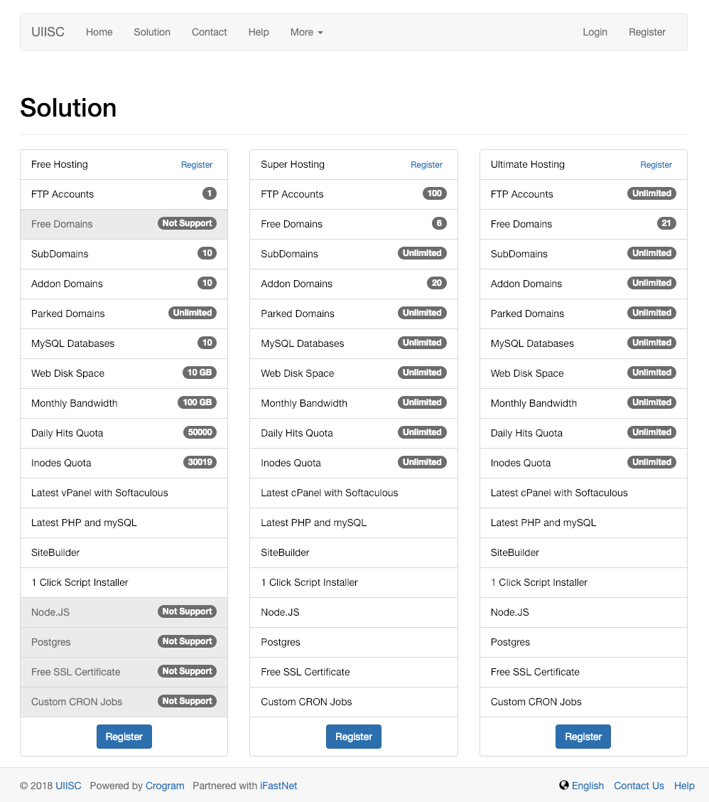
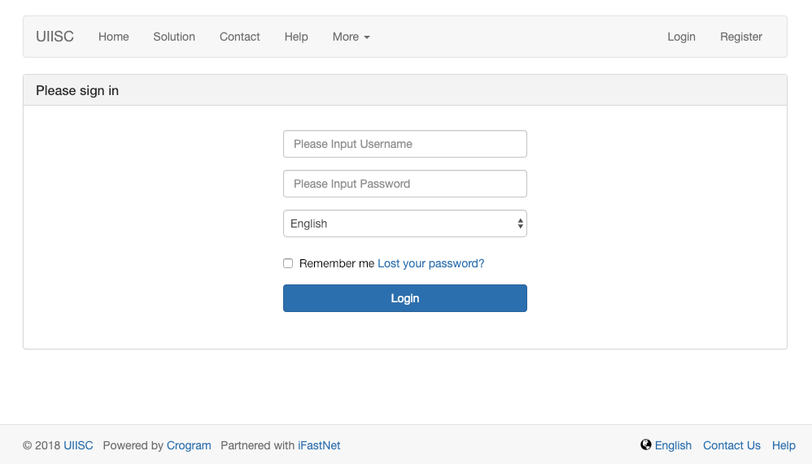
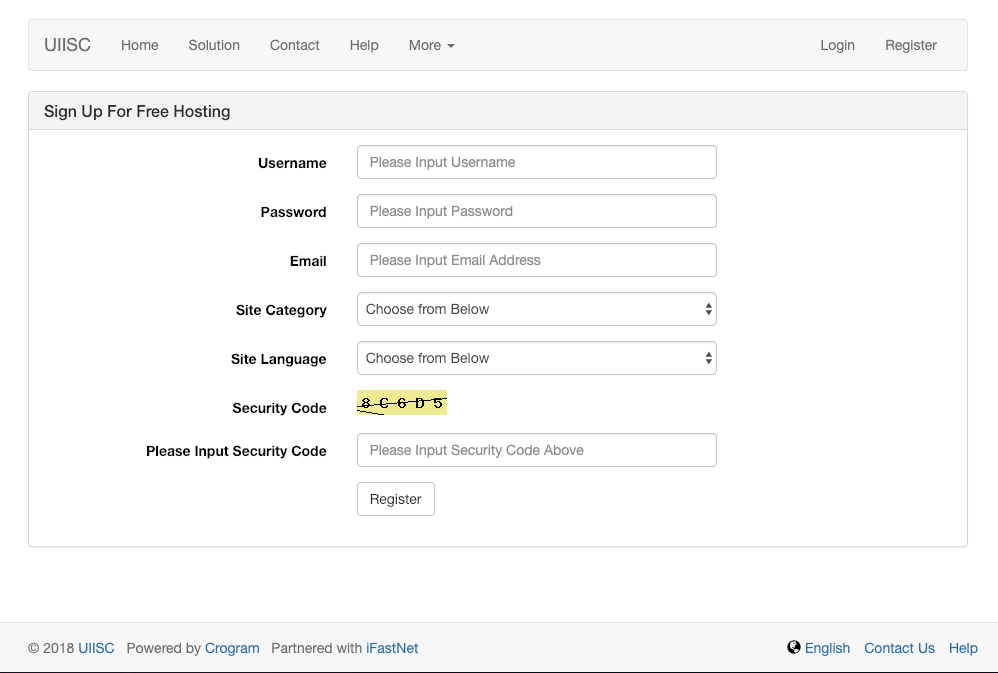

# UIISC

An Open Source Web Hosting Account and Support Management System for MyOwnFreeHost

- Official Site : [uiisc.com](http://uiisc.com "UIISC")
- Author : [Jackson Dou](https://github.com/jksdou "Jackson Dou")

## Functions

### multi-language module

- [x] Load default language
- [x] Change language

### ClientArea module

- [x] Account registration
- [x] Account verification
- [x] Account cancellation
- [x] Email verification
- [x] Profile modification
- [x] Login / Logout, Forget / Reset / Change password
- [x] Apply for a web hosting account
- [x] Web hosting account deletion / deactivation
- [x] Login to web hosting control panel

### AdminArea module

- [x] Verify if a domain is available
- [x] Creation of hosting account
- [x] Change password to hosting account
- [x] Deactivate or disable a hosting account
- [x] Activate or enable hosting account
- [x] Verify how many domain and state of the hosting account
- [x] Members management
- [x] Site configuration
- [x] API configuration
- [x] News management
- [ ] Translation file management

### forum module

- [ ] Add/edit/delete posts

## Screenshot

##### <u>Solution Page</u>

> 

##### <u>Login Page</u>

> 

##### <u>Register Page</u>

> 
